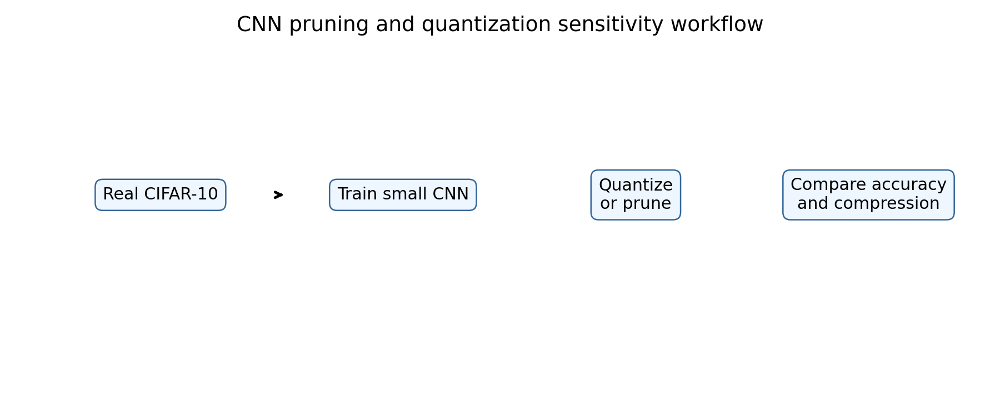
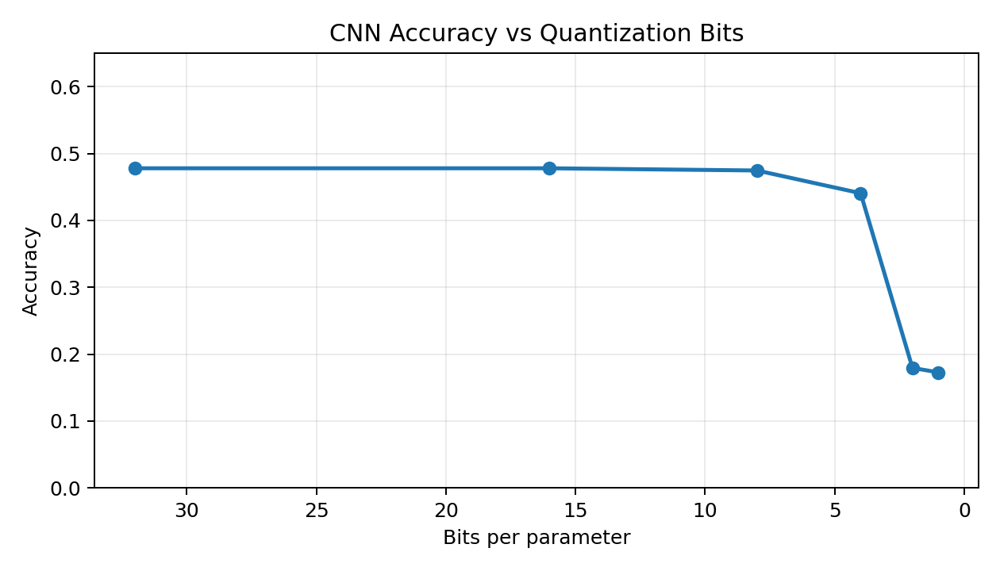
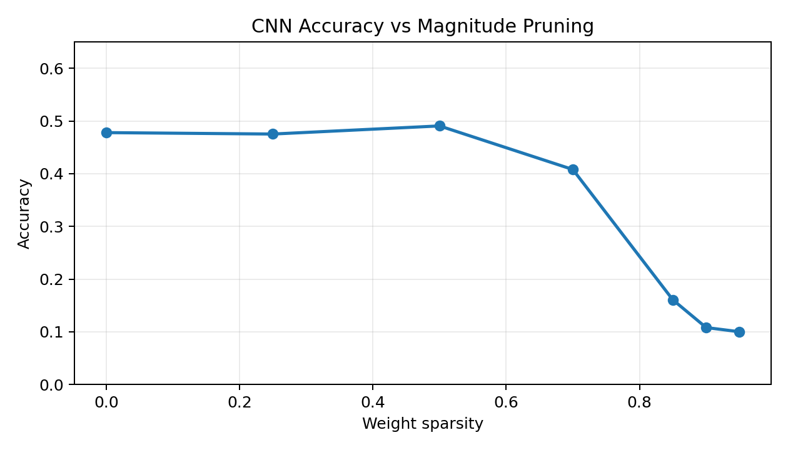
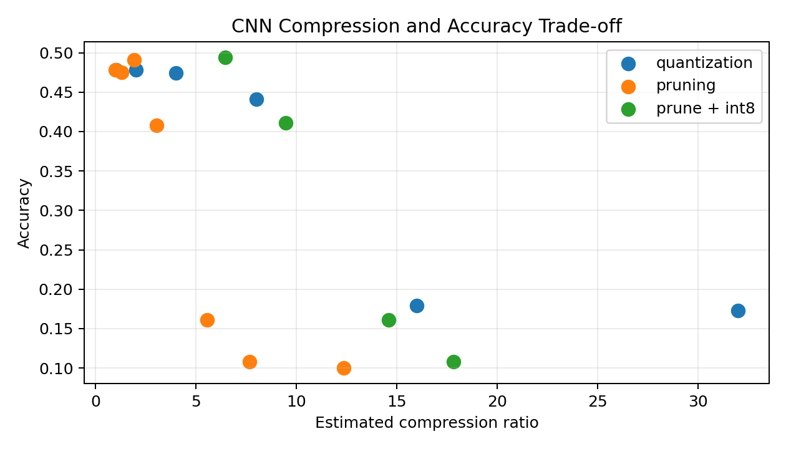

# CNN Quantization and Pruning Sensitivity Lab


Figure: quantization stores the same model weights with fewer bits.


Figure: quantization reduces numeric precision, while pruning removes less important weights.



Figure: a small CNN is trained on real CIFAR-10, then quantization, pruning, and pruning plus int8 are compared.

## Motivation

Compression methods are useful only if we measure how accuracy changes. This project compares quantization and pruning on the same CNN so we can see which method is safer under different compression levels.

## Project Goal

We trained a small CNN on real CIFAR-10 and evaluated:

- Weight quantization from 32-bit to 1-bit
- Magnitude pruning from 0% to 95% sparsity
- Pruning followed by int8 quantization

## Dataset

We used the official CIFAR-10 Python archive.

- Training images: 6,000
- Test images: 1,500
- Classes: 10
- Image size: 32x32 RGB

## Model

The model is a small CNN with three convolution blocks, batch normalization, ReLU, pooling, and a linear classifier.

| Setting | Value |
|---|---:|
| Parameters | 94,986 |
| Epochs | 6 |
| Optimizer | Adam |
| Learning rate | 0.001 |
| Weight decay | 0.0001 |
| Baseline accuracy | 0.4780 |
| Baseline macro F1 | 0.4539 |

## Quantization Results

| Bits | Accuracy | Macro F1 | Compression vs FP32 |
|---:|---:|---:|---:|
| 32 | 0.4780 | 0.4539 | 1.00 |
| 16 | 0.4780 | 0.4539 | 2.00 |
| 8 | 0.4747 | 0.4519 | 4.00 |
| 4 | 0.4407 | 0.4067 | 8.00 |
| 2 | 0.1793 | 0.1246 | 16.00 |
| 1 | 0.1727 | 0.1144 | 32.00 |



## Pruning Results

| Sparsity | Accuracy | Macro F1 | Compression Ratio |
|---:|---:|---:|---:|
| 0.00 | 0.4780 | 0.4539 | 0.98 |
| 0.25 | 0.4753 | 0.4518 | 1.29 |
| 0.50 | 0.4907 | 0.4607 | 1.90 |
| 0.70 | 0.4080 | 0.3991 | 3.04 |
| 0.85 | 0.1607 | 0.0880 | 5.55 |
| 0.90 | 0.1080 | 0.0332 | 7.66 |
| 0.95 | 0.1000 | 0.0182 | 12.36 |





## Interpretation

Int8 quantization is safer than aggressive pruning. It keeps accuracy almost unchanged with 4x compression. Moderate pruning is also useful: 50% sparsity slightly improves the result, likely because it removes weak noisy weights. After 70% sparsity, accuracy starts to fall, and 85% or higher damages the model heavily.

The best combined result is 50% pruning followed by int8: 0.4940 accuracy with an estimated 6.44x compression ratio.

## Conclusion

For this CIFAR-10 CNN, int8 quantization and moderate pruning are useful. Very low-bit quantization and very high sparsity are not safe. The practical choice depends on whether the goal is memory reduction, sparse inference, or minimum accuracy loss.

## How To Run

```bash
pip install -r requirements.txt
python 1_cifar10_cnn_compression_sensitivity.py
```
