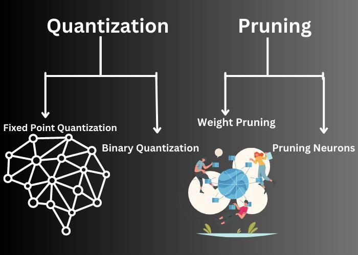
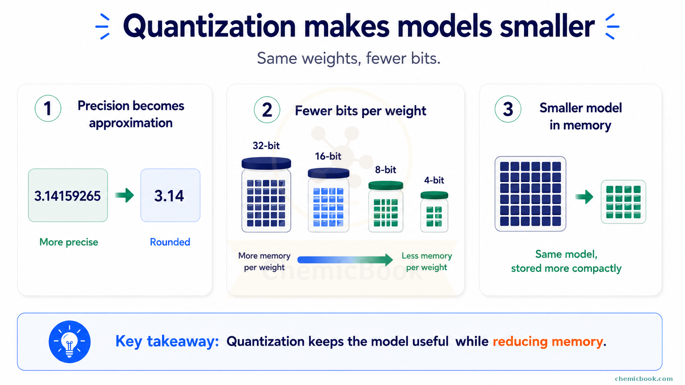

# MLP Quantization and Pruning Sensitivity Lab



Figure: quantization reduces precision, while pruning removes weights or neurons. This project compares both ideas on the same MLP classifier.



Figure: quantization stores model parameters with fewer bits, reducing memory while trying to keep the model useful.

## Motivation

Model compression is important for edge AI and embedded AI because smaller models are easier to store, transfer, and deploy. Two common compression methods are quantization and pruning. They solve related but different problems:

- Quantization stores each parameter with fewer bits.
- Pruning removes low-importance weights to create sparsity.

The important research question is not only "Which method compresses more?" We also need to ask when accuracy starts to fall and which method is safer under different deployment conditions.

## Project Goal

We trained an MLP classifier on the same controlled CIFAR-style dataset used in the previous quantization project. Then we tested:

1. Quantization sensitivity from 32-bit down to 1-bit weights.
2. Magnitude pruning sensitivity from 0 percent to 98 percent weight sparsity.
3. Combined pruning plus INT8 quantization.

The aim is to understand how quickly accuracy changes as compression becomes stronger.

## Dataset

The dataset is a controlled CIFAR-style image dataset with:

- 1200 RGB images.
- Image size: 16x16x3.
- 3 visual classes.
- Simple color and shape patterns.

It is not the real CIFAR dataset. It is a local image-like dataset designed so the compression experiment can run offline and stay reproducible.

## Tools

Python, NumPy, pandas, scikit-learn, and matplotlib.

## Model

We trained an MLP classifier:

- Input: flattened 16x16x3 image vector.
- Hidden layers: `(64, 32)`.
- Activation: ReLU.
- Optimizer: Adam.
- Early stopping: enabled.
- Test split: 25 percent.
- Random seed: 42.

The trained model had:

| Property | Value |
|---|---:|
| Total parameters | 51,395 |
| Weight parameters | 51,296 |
| Baseline storage estimate | 411,160 bytes |
| Baseline accuracy | 1.0000 |
| Baseline macro F1 | 1.0000 |

## Quantization Experiment

We quantized the trained MLP weights to different bit widths and evaluated the same test set.

| Bits per Parameter | Accuracy | Macro F1 | Compression Ratio vs Float64 |
|---:|---:|---:|---:|
| 32 | 1.0000 | 1.0000 | 2.00 |
| 16 | 1.0000 | 1.0000 | 4.00 |
| 8 | 1.0000 | 1.0000 | 8.00 |
| 4 | 1.0000 | 1.0000 | 16.00 |
| 2 | 0.9767 | 0.9766 | 32.00 |
| 1 | 0.7200 | 0.6591 | 64.00 |


## Pruning Experiment

We pruned small-magnitude weights and measured the accuracy after each sparsity level.

| Weight Sparsity | Accuracy | Macro F1 | Compression Ratio vs Dense Float64 |
|---:|---:|---:|---:|
| 0.00 | 1.0000 | 1.0000 | 0.98 |
| 0.25 | 1.0000 | 1.0000 | 1.31 |
| 0.50 | 1.0000 | 1.0000 | 1.94 |
| 0.70 | 1.0000 | 1.0000 | 3.16 |
| 0.85 | 1.0000 | 1.0000 | 5.98 |
| 0.90 | 1.0000 | 1.0000 | 8.52 |
| 0.95 | 1.0000 | 1.0000 | 14.83 |
| 0.98 | 0.3333 | 0.1667 | 26.68 |


## Combined Pruning and INT8

We also tested pruning first and then applying INT8 quantization.

| Method | Accuracy | Macro F1 | Compression Ratio vs Dense Float64 |
|---|---:|---:|---:|
| prune 50 percent then INT8 | 1.0000 | 1.0000 | 12.52 |
| prune 70 percent then INT8 | 1.0000 | 1.0000 | 18.20 |
| prune 85 percent then INT8 | 1.0000 | 1.0000 | 27.60 |
| prune 90 percent then INT8 | 1.0000 | 1.0000 | 33.34 |


## Interpretation

Quantization was very safe down to 4-bit in this controlled task. At 2-bit, accuracy started to fall slightly. At 1-bit, the model lost too much information and accuracy dropped strongly.

Pruning was also safe up to 95 percent sparsity, but 98 percent pruning destroyed the model. This means the MLP had many redundant weights, but not unlimited redundancy.

The combined method was strongest in this experiment. Pruning 90 percent of weights and then applying INT8 quantization kept full accuracy while reaching an estimated 33.34x compression ratio.

## Which Method Is Better?

For general deployment, INT8 quantization is usually the safer first choice. It is simple, hardware-friendly, and often supported by inference runtimes.

Pruning is useful when the deployment system can exploit sparse matrices. If the hardware or inference library cannot speed up sparse operations, pruning may reduce theoretical storage but not real latency.

In this specific experiment:

- Best safe simple method: 4-bit quantization, because it kept 1.0000 accuracy with 16x compression.
- Best high-compression method: 90 percent pruning plus INT8, because it kept 1.0000 accuracy with 33.34x estimated compression.
- Unsafe setting: 98 percent pruning and 1-bit quantization, because both caused large accuracy loss.

## Conclusion

Quantization and pruning are complementary. Quantization reduces bits per parameter; pruning reduces the number of active weights. The best compression strategy depends on the target hardware, the allowed accuracy loss, and whether sparse inference is supported.

## How To Run

```bash
pip install -r requirements.txt
python 1_mlp_quantization_pruning_sensitivity.py
```
